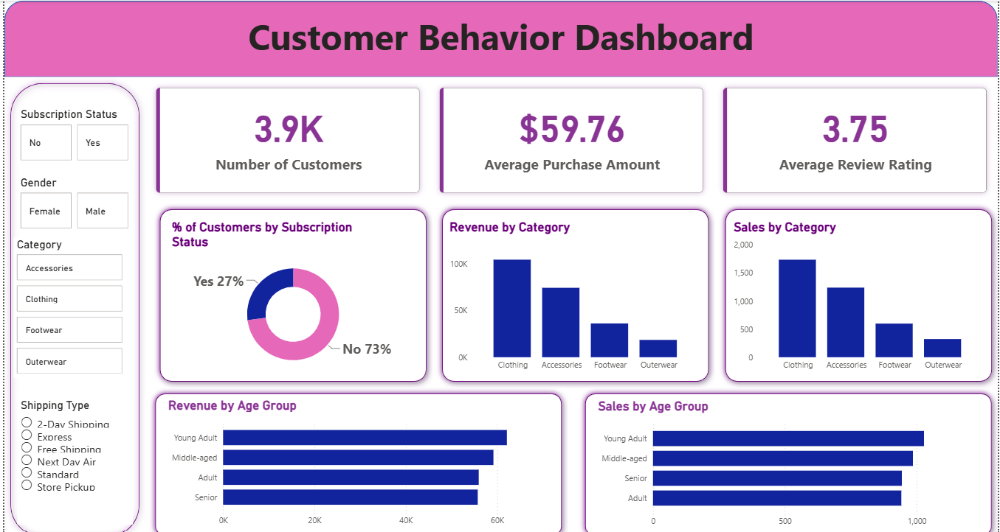

# Customer Behavior Analysis
An end-to-end data analytics project that explores customer purchasing behavior — from raw data cleaning in Python to SQL-based analysis and an interactive Power BI dashboard.
## Overview
This project analyzes customer transaction data to uncover patterns in purchasing behavior across age groups, categories, subscription status, and other segments. The workflow covers the full analytics pipeline: data cleaning and exploratory analysis in Python, business-question answering via SQL, and visualization through an interactive Power BI dashboard.
## Dataset
- **Source:** [Kaggle]
- **Key fields:** customer_id, age, gender, item_purchased, category, purchase_amount, location, size, color, season, review_rating, subscription_status, shipping_type
## Tools & Technologies
| Category | Tools |
|---|---|
| Data Cleaning & EDA | Python (Pandas, NumPy, Matplotlib/Seaborn) |
| Database | PostgreSQL |
| Querying | SQL |
| Visualization | Power BI |
| Reporting | PPT (built with Gamma) |
## Project Workflow
1. **Data Loading & Cleaning (Python)**
   - Loaded the raw dataset into a Pandas DataFrame
   - Handled missing values (e.g., imputing `Review Rating`)
   - Standardized column names and data types
   - Performed exploratory data analysis to understand distributions and outliers
2. **Database Setup & SQL Analysis**
   - Loaded the cleaned dataset into a PostgreSQL database
   - Wrote SQL queries to answer key business questions (e.g., revenue by age group, category-wise sales, subscription trends)
   - Queries documented in `sql/queries.sql`
3. **Dashboard Development (Power BI)**
   - Connected Power BI to the PostgreSQL database
   - Built an interactive dashboard with KPIs, filters, and visual breakdowns by category, age group, and subscription status
4. **Reporting**
   - Summarized key findings in a written report
   - Created a presentation deck using Gamma for stakeholder-friendly communication
## Dashboard

**Key metrics tracked:**
- Number of Customers
- Average Purchase Amount
- Average Review Rating
- Revenue & Sales by Category
- Revenue & Sales by Age Group
- Subscription Status Distribution
## Key Results & Insights
- Young Adults contribute the highest share of total revenue among all age groups.
- Clothing is the top-performing category by both revenue and sales volume.
- Only 27% of customers are active subscribers, indicating room to improve retention.
## Repository Structure
```
customer-behavior-analysis/
│
├── README.md
├── dataset/
│   └── customer_data.csv
├── notebooks/
│   └── data_cleaning_eda.ipynb
├── sql/
│   └── queries.sql
├── dashboard/
│   ├── customer_behavior_dashboard.pbix
│   └── customer_behavior_dashboard.png
├── report/
│   └── analysis_report.pdf
└── presentation/
    └── project_summary.pptx
```
## How to Run
1. Clone the repository
   ```
   git clone https://github.com/Shakti-singh-visen/customer-behavior-analysis.git
   ```
2. Install Python dependencies
   ```
   pip install -r requirements.txt
   ```
3. Open `notebooks/data_cleaning_eda.ipynb` to view the data cleaning and EDA process
4. Load `sql/queries.sql` into PostgreSQL (or your preferred SQL client) to run the analysis queries
5. Open `dashboard/customer_behavior_dashboard.pbix` in Power BI Desktop to explore the interactive dashboard
## Author
**Shivanshi Singh**
📧 Shivanshi1205@gmail.com
🔗 [LinkedIn](https://www.linkedin.com/in/shivanshi-singh-412518288)
💻 [GitHub](https://github.com/shivanshi1205-svg)   authore me changes kiya hai check kar lo
